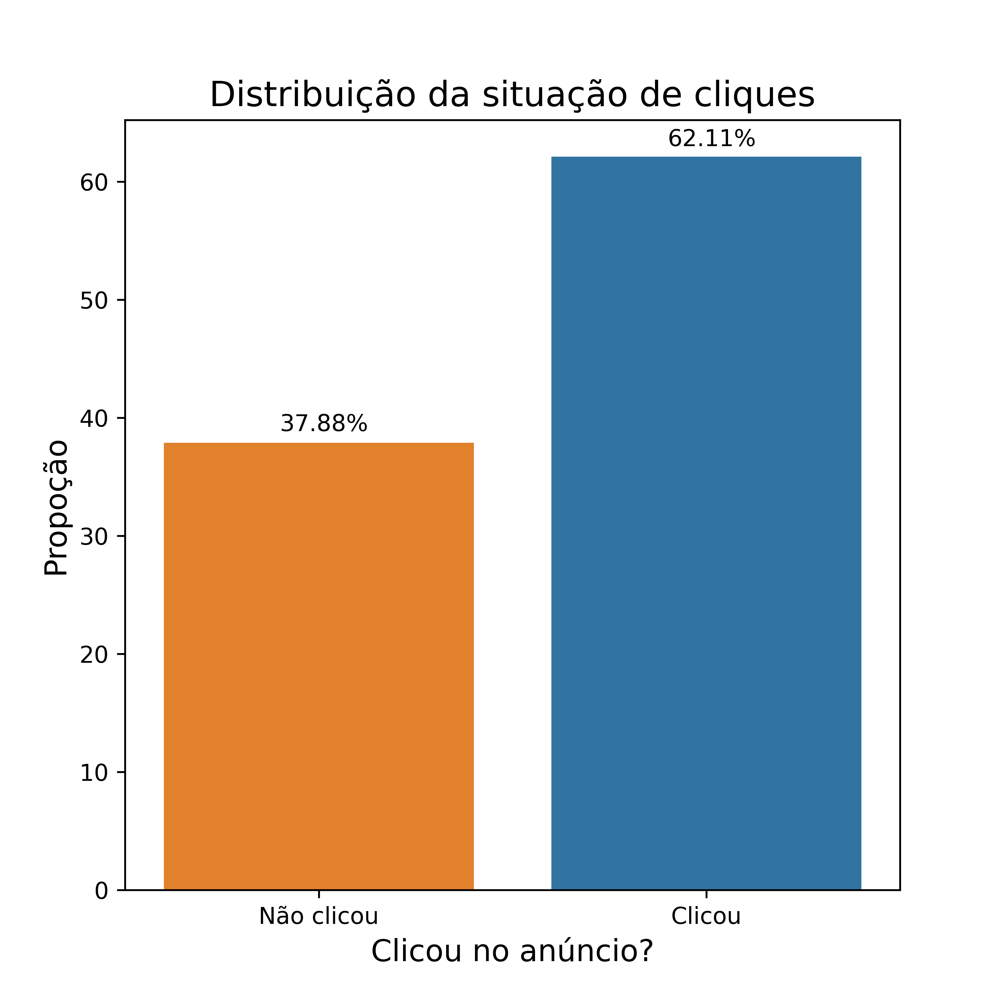
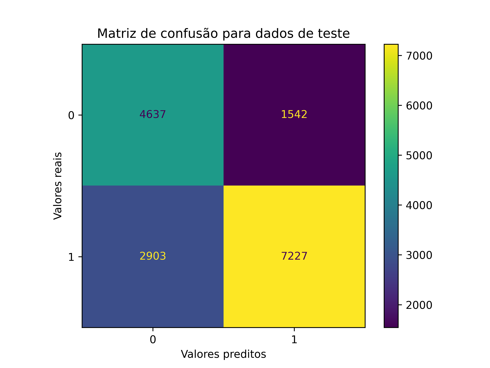
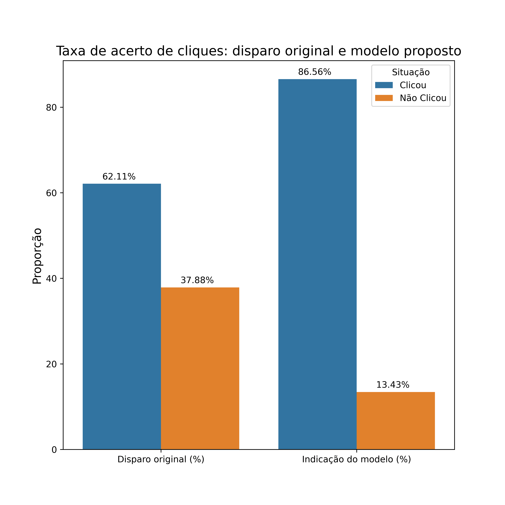

# Projeto final (G3)
Este repositório contém a entrega final da trilha de Dados da Ada junto com a RaiaDrogasil. Nele simulamos uma entrega executiva de um projeto. Este é o grupo 3, composto por:

* Anthony Zaneta Mattos de Avila
* Thaís De Souza Marins
* Luiz Gustavo Nogueira Silva
* Gabriel Voltani Vatanabe
* Jonas Henrique Arjona Gonçalves Vieira

Como parte do Storytelling, introduzimos a **aDSQ**, uma empresa fictícia criada pelos membros do grupo que presta consultoria em dados para empresas do setor de Tech.

# Como utilizar os arquivos
Cada paste dentro de `main` contém uma etapa do processo de análise, um script em .py e um arquivo MD descrevendo melhor aquela etapa. Os scripts dessa análise em específico são independentes e podem ser rodados na ordem que for desejado. Os dados usados e produzidos nas análises ficam na pasta `data` e os gráficos na pasta `outputs`.

Para rodar os mesmos scripts para dados diferentes é preciso que o arquivo seja renomeado como `data_raw.csv` e colocado dentro da pasta `data`. Ele precisa possuir as seguintes colunas e formatos:

|Coluna|Formato|
|---|---|
|`Daily Time Spent on Site`|float|
|`Age`|int|
|`Daily Internet Usage`|float|
|`Timestamp`|indiferente já que não entra na análise|
|`Area Income`|object|
|`City`|object|
|`Male`|int|
|`Country`|object|
|`Clicked on Ad`|int|

Feito isso podemos rodar todos os scripts na sequência proposta no esquema de pastas: começamos pela introdução, EDA, correlações, modelo e conclusão. Todos os gráficos gerados estarão na pasta `outputs`.

Além dos arquivos .py, dentro de `main` temos a pasta `notebook` que contém a análise inteira em formato Jupyter Notebook, caso seja preferível visualizar ela dessa forma.

# Bibliotecas necessárias
Utilizamos bibliotecas de diversas finalidades. Abaixo estão elas:

``` python
import pandas as pd
import numpy as np
import matplotlib.pyplot as plt
import seaborn as sns
from scipy.stats import ttest_ind
from sklearn.model_selection import train_test_split,cross_validate,StratifiedKFold,RandomizedSearchCV
from sklearn.pipeline import Pipeline
from sklearn.preprocessing import MinMaxScaler,OneHotEncoder
from sklearn.impute import SimpleImputer
from sklearn.compose import ColumnTransformer
from sklearn.tree import DecisionTreeClassifier, plot_tree
from sklearn.metrics import confusion_matrix, ConfusionMatrixDisplay, classification_report,f1_score,accuracy_score,precision_score,recall_score,roc_auc_score
```

No arquivo `requirements.txt` também temos a relação as bibliotecas utilizadas.

```python
pip install -r requirements. txt 
```

# O problema de negócios
A **aDSQ** é uma empresa que presta consultoria na área de dados para outras empresas, especialmente aquelas que trabalham da área de Tech.

<p align="center">
  
</p>

A empresa contratante nos trouxe um problema de negócio: Baixo resultado referente a disparos de anúncios. A campanha, apesar do alto valor investido, convertia em poucos cliques e compras. A estratégia **NÃO FAZIA** uso de dados para o direcionamento de anúncios, o que dificultava que a empresa atingisse metas de vendas.

<p align="center">
  
</p>

Busca-se o disparo de forma mais consistente para melhora dos resultados. 

Foi solicitada a análise da aDSQ que selecionaria quais usuários devem receber anúncios, gerando uma economia financeira e maior eficiência. Para isso a empresa disponibilizou uma base de dados, referente ao último disparo que foi extraída pelo Google Analytics.

# Passo a passo sumarizado da solução
## Parte 1 - EDA e Tratamento de Dados

Primeiro, realizamos a Análise Exploratória de Dados (EDA) e o tratamento da base, executando, em suma:

1. **Tratamento de Dados:**
   - Remoção de dados nulos e usuários menores de 18 anos, devido a decisão de negócio.
   - Identificação e eliminação de valores negativos não plausíveis em algumas variáveis.

2. **Variáveis Relevantes:**
   - Identificação das variáveis (features) relevantes para análise, considerando correlações com o alvo (clicar no anúncio).
     
|Coluna|
|---|
|`Daily Time Spent on Site`|float|
|`Age`|int|
|`Daily Internet Usage`|float|
|`Timestamp`|indiferente já que não entra na análise|
|`Area Income`|object|
|`City`|object|
|`Male`|int|
|`Country`|object|
|`Clicked on Ad`|int|

[Saiba mais sobre EDA aqui](https://github.com/arjona-jonas/ADA_Projeto_Final_G3/tree/main/main/02-eda)

3. **Visualizações e Distribuições:**
   - Análise da distribuição das variáveis numéricas com foco em identificar outliers.
   - Exploração de variáveis qualitativas discretas, como `Ad Topic Line`, `City` e `Country`, com destaque para a criação da variável `Continent` e análise do comprimento dos títulos dos anúncios (`Ad Topic Line`).

4. **Correlações:**
   - Avaliação das correlações entre variáveis numéricas e as duas variáveis dummy (`Clicked on Ad` e `Male`).
   - Destaque para correlações relevantes, como a negativa entre `Clicked on Ad` e `Daily Internet Usage`, e a positiva entre `Clicked on Ad` e `Age`.

[Saiba mais sobre Correlações aqui](https://github.com/arjona-jonas/ADA_Projeto_Final_G3/tree/main/main/03-correlacoes)

## Parte 2 - Modelagem Preditiva

Utilizando técnicas de aprendizado de máquina (ML), prevemos se o usuário irá ou não clicar no anúncio.

### Variáveis Preditivas Identificadas:

- **Idade:** Usuários mais velhos têm maior propensão a clicar nos anúncios.
- **Daily Time Spent on Site e Daily Internet Usage:** Menor tempo gasto no site ou na internet está associado a
maior taxa de cliques.
- **Area Income:** Usuários de áreas com renda menor tendem a clicar mais nos anúncios.

### Tratamento Pré-Modelo e *Pipeline*:

Para chegarmos no modelo, construímos uma *Pipeline* para selecionarmos as features de interesse. Isso foi feito ao separarmos os dados entre treino e teste, fazendo as transformações com Z-Score e Min-Max Scaler, numa proporção de 20% e 60%. 
     
## **Parte 3 - Árvore de Decisão**

O modelo final escolhido foi baseado em Árvore de Decisão, otimizado para maximizar a precisão (*Precision*) de previsão de cliques em anúncios da empresa contratante. Aqui estão as métricas de desempenho nos conjuntos de treino e teste:

**F1 Score:**
  - Treino: 0.9142
  - Teste: 0.8704

**Accuracy:**
  - Treino: 0.9239
  - Teste: 0.8805

**Precision:**
  - Treino: 0.8881
  - Teste: 0.8534

**Recall:**
  - Treino: 0.9433
  - Teste: 0.8899

**ROC AUC:**
  - Treino: 0.9244
  - Teste: 0.8762

### Matriz de Confusão:
A matriz de confusão para os dados de teste mostra como o modelo está performando em diferentes cenários(falsos positivos, falsos negativos, verdadeiros positivos e verdadeiros negativos).

<div align="center">
  
  
</div>

### Comparação com a Estratégia Original:

A estratégia original da empresa resultou em uma taxa de acerto/cliques de 62.11%, enquanto, **após a aplicação do modelo de Árvore de Decisão, a taxa de acertos subiu para 82.41%**, representando um aumento percentual significativo de 38.25%. Isso destaca a eficácia do modelo em otimizar a seleção de usuários-alvo.

<p align="center">
  
</p>

[Saiba mais sobre nosso Modelo aqui](https://github.com/arjona-jonas/ADA_Projeto_Final_G3/tree/main/main/04-modelo)

# Considerações finais
## Perfil Ideal de Alvo: 
Com base nas variáveis mais relevantes, podemos criar um perfil do usuário ideal para direcionar estratégias de marketing mais eficazes. O usuário ideal é provavelmente:

**Mais Velhos:**
- Usuários mais velhos demonstram maior propensão a clicar nos anúncios, tornando-os um alvo ideal para campanhas direcionadas.

**Menor Tempo Diário no Site e Internet:**
- Indivíduos que passam menos tempo diário online, seja no site ou na internet em geral, apresentam uma taxa de cliques mais elevada. Isso sugere uma estratégia eficaz de atingir esses usuários que sabem o que querem e não perdem tempo. 

**Renda Local Inferior:**
 - Usuários com renda comparativamente menor em relação à média local tendem a ser mais receptivos aos anúncios, indicando uma oportunidade para campanhas direcionadas a esse segmento focando em, por exemplo, promoções. 

## Oportunidade de Negócio:
Com o suporte de nosso modelo, a empresa tem à sua disposição **três propostas distintas**, todas com benefícios diferentes e específicos relacionados a valores, tempo e desempenho da campanha.

### Proposta #1: Mais Rapidez

- **Investimento Diário:** Mantendo o investimento diário de ~R$250,00.
- **Resultados:** Resultados mais rápidos, com a redução de **68 dias** da campanha. 

### Proposta #2: Redução do Investimento

- **Investimento Diário:** Diminuição do investimento para ~R$188,00 diários.
- **Resultados:** Mesmos resultados em termos de tempo e cliques, porém, com uma economia total de **R$16.740,00**.

### Proposta #3: Aumento de Cliques

- **Investimento Diário:** Manutenção do investimento em ~R$250,00.
- **Resultados:** Mantendo o investimento e o tempo, essa proposta **visa aumentar a quantidade de cliques**, proporcionando uma média de **16.830 cliques adicionais** ao final da campanha.

O objetivo da aDSQ aqui é oferecer flexibilidade a empresa contratante, permitindo que a abordagem e estratégia de marketing seja adaptada a seus objetivos e possibilidades. 


