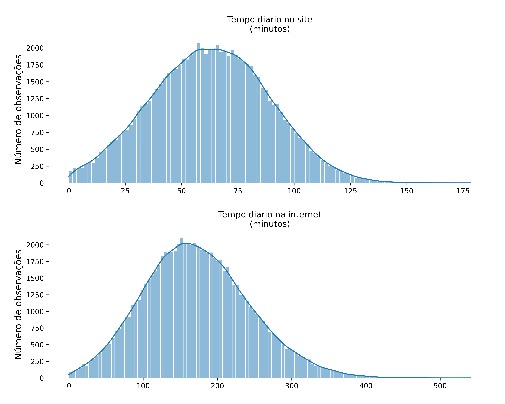
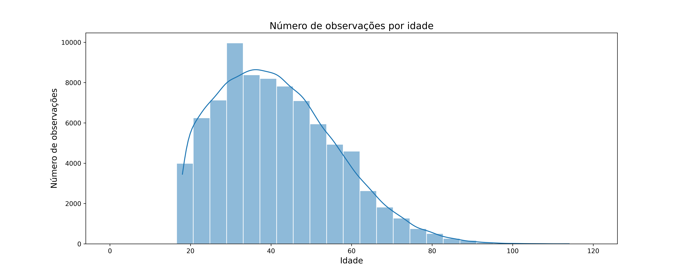
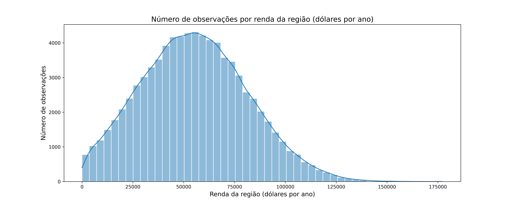
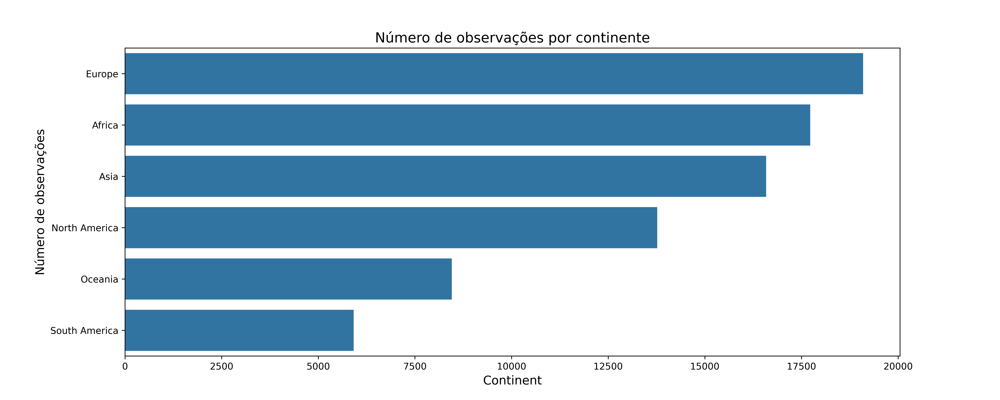
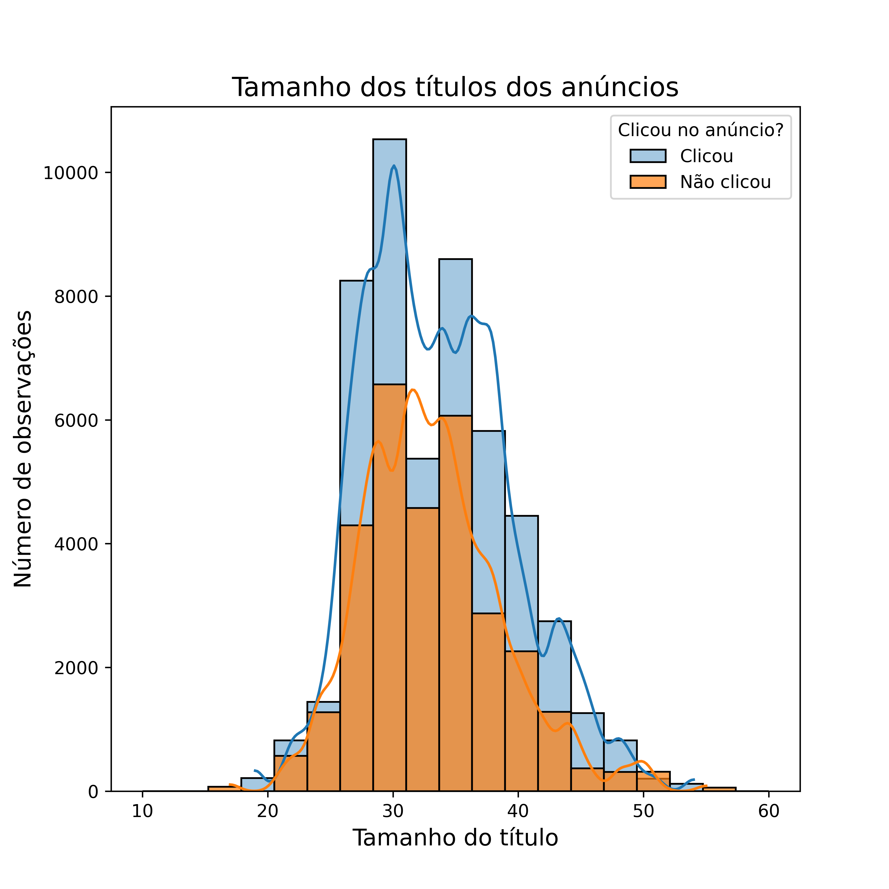

# As variáveis

Primeiro, checamos a presença de *outliers* nas quantitativas para depois ir caso a caso avaliando as distribuições. Usamos duas funções para checar *outliers* auxiliares: *get_limits* obtém os limites inferior e superior dos dados; *count_outliers* conta quantos valores estão fora desses limites. Visualizamos a proporção num *DataFrame*.

Uma fração muito pequena dos dados são *outliers*. Sabemos que eles não são menores que zero. Optamos por manter essas observações já que são valores plenamente plausíveis, apesar de incomuns.

## `Daily Time Spent on Site` e `Daily Internet Usage`

Ambas essas variáveis medem algo muito parecido: tempo em minutos, primeiro no site da empresa, segundo na internet como um todo. As médias e medianas estão próximas, alguma simetria nos dados, mas com dispersão razoável (desvios padrões na casa dos 40% da média). Abaixo seus histogramas.

O tempo diário no site ficou, em sua maioria entre 45 e 80 minutos, enquanto que o tempo diário na internet ficou entre 100 e 250 minutos.

## `Age`

É a idade do usuário que recebeu o disparo. Média e mediana são bem próximas e dados razovelmente dispersos (desvio padrão de 45% da média). A casa dos 30 anos é a mais presente na nossa base. A distribuição dos dados definitivamente é assimétrica.

## `Area Income`

É a renda anual em dólares da região do usuário. Vemos também média e medina próximas e desvio padrão próximo dos 50% do valor da média. Os casos extremos, apesar de incomuns, são plausíveis: de fato há pessoas que tem rendas absurdamente maiores ou menores do que média. Sua distribuição segue abaixo. A maior das rendas está entre 25K e 75K de dólares.

## `Timestamp`

Não usamos essa variável na nosssa análise.

## `Ad Topic Line`, `City` e `Country`

Essas três variáveis são qualitativas discretas com muitos valores cada. Por conta disso, há certa dificuldade em plotar e extrair muitas informações delas. Os valores são muito dispersos. Mesmo o título ("Versatile content-based protocol",135 entradas), país ("Cambodia",440 entradas) e cidade ("Williamsport",205 entradas) mais recorrente compõem uma parcela muito pequena dos dados.

Para extrair alguma informação dessas variáveis, executamos dois procedimentos. O primeiro deles é a introdução de uma coluna com os continentes dos países, reduzindo assim a variação de possíveis valores. Usamos um outro arquivo CSV para fazer essa associação. O único continente que ficou de fora foi a Antártica, pelo pequena quantidade de observações.

Como está a distribuição dos continentes? Europa e África são os continentes mais recorrentes.

O segundo procedimento foi em `Ad Topic Line`. Criamos uma nova variável com o número de caracteres do texto. Visualizamos a distribuição dos valores distinguindo por situação do clique. Aparentemente não há diferença entre clicar ou não clicar pelo número de caracteres do `Ad Topic Line`, apenas que a faixa entre 25 e 40 caracteres tem o maior número de anúncios.

## `Clicked on Ad` e `Male`

As variáveis `Clicked on Ad` e `Male` serão mantidas nessa formato já que elas já se encontram do jeito que desejados lidar, _dummies_ com valores 0 ou 1. Vejamos suas distribuições. Cerca de 60% dos usuários não clicaram no anúncio e 40% clicaram. A distribuição pelos sexos é bastante equilibrada, próximo do 50/50.

## Situação da base

Após as manipulações temos 81.542 observações e 12 variáveis.