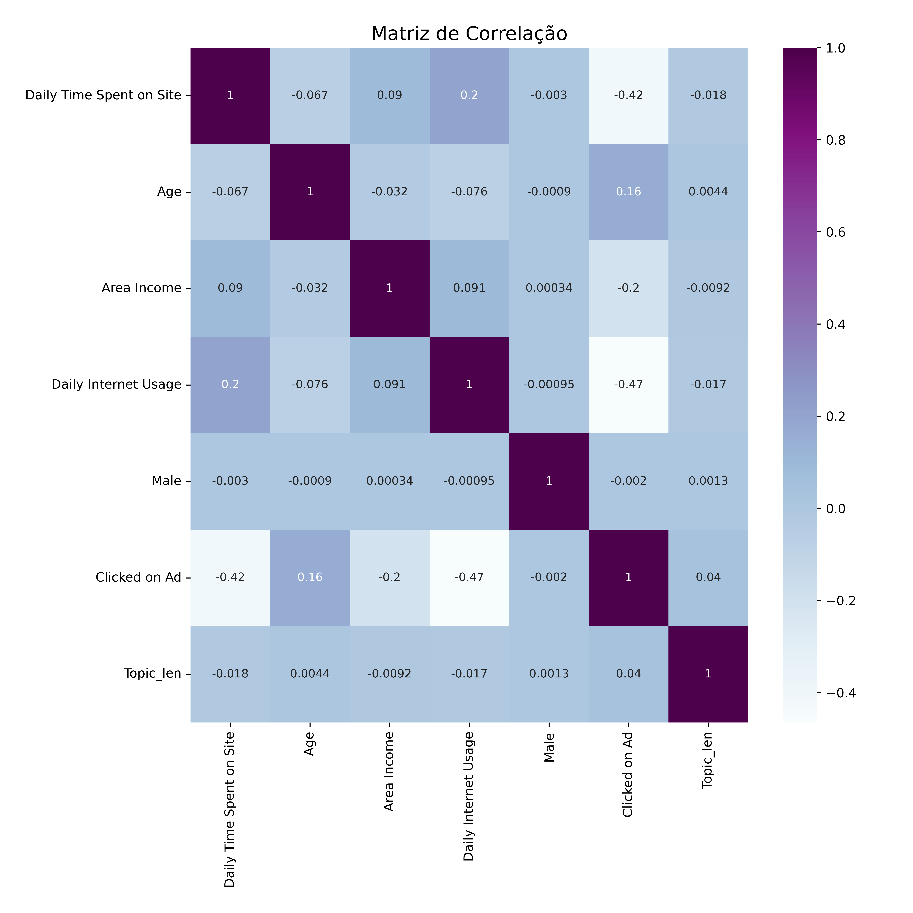
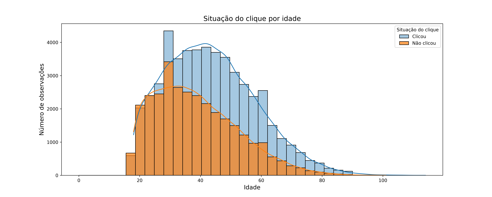
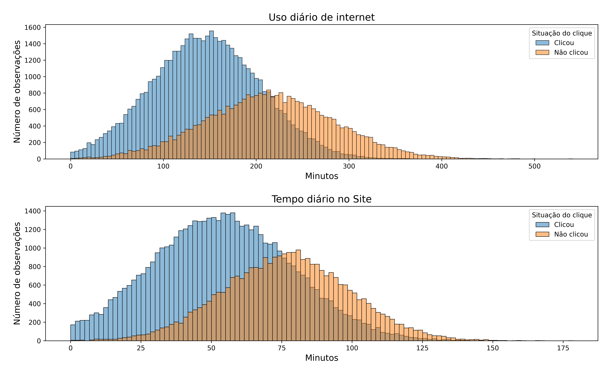
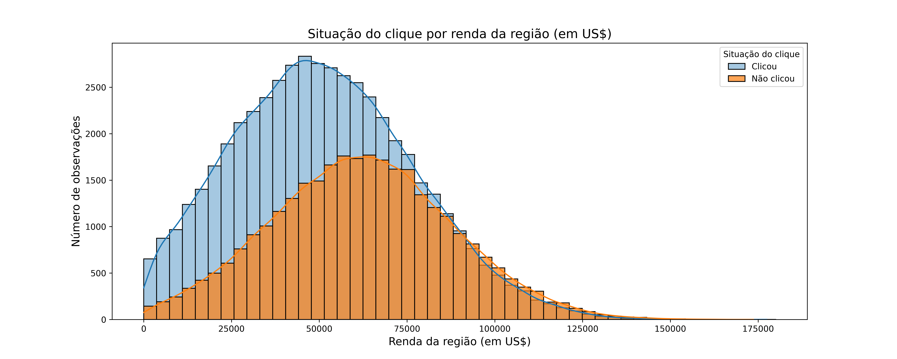
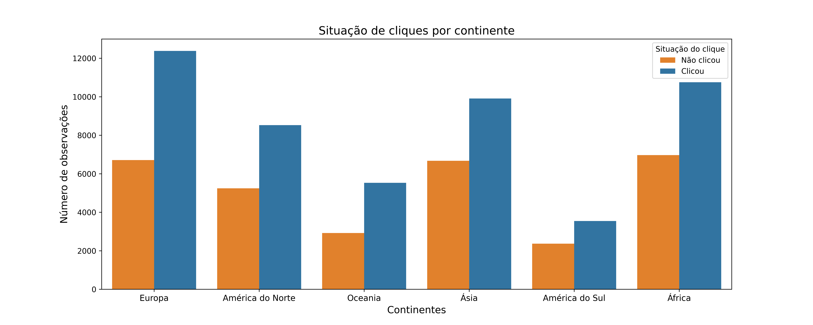

# Parte 3 - Correlações

Checaremos as correlações, considerando apenas as númericas e nossas duas *dummies*.

Apesar de correlação não implicar causalidade, destacamos os resultados encontrados. No geral não houve fortes correlações entre as variáveis.

* `Daily Internet Usage` e `Daily Time Spent on Site`: correlação positiva de **0.2**
* `Clicked on Ad` e `Age`: correlação positiva de **0.16**
* `Clicked on Ad` e `Daily Time Spent on Site`: correlação negativa de **-0.42**
* `Clicked on Ad` e `Daily Internet Usage`: correlação negativa de **-0.47**
* `Clicked on Ad` e `Area Income`: correlação negativa de **-0.2**

## `Daily Internet Usage` e `Daily Time Spent on Site`

Ambas as variáveis de tempo estão correlacionadas positivamente (0.2), algo que faz sentido já que uma depende (em certa medida) da outra: tempo no site é também tempo navegando na internet. Trata-se de um típico caso de colinearidade.

Por conta do número de pontos, é difícil de visualizar a relação. Por isso optamos por não gerar nenhum gráfico para esta interação.

## `Clicked on Ad` e `Age`

Esperávamos que a própria quantidade de cliques também fosse diferente para diferentes idades. Confirmamos essa suposição: o histograma dos que clicaram é mais localizado à direita e centralizado nas maiores idades (por volta dos 40 anos), enquanto que aqueles que não clicaram são majoritamente mais novos (abaixo dos 40 anos).

A fim de melhor identificar as diferenças entre os grupos, executamos um Teste T para comparar os dois grupos se descobrir se, estatisticamente falando, eles são de fato diferentes na variável numérica considerada.

Neste teste comparamos duas médias de duas populações independentes. Nossas hipóteses são:

* H0: Média de idade do "Clicou" *é igual* a Média de idade do "Não clicou"
* H1: Média de idade do "Clicou" *é diferente* da Média de idade do "Não clicou"

Rejeitamos H0 caso o p-valor do teste resulte num número menor que 5%. A estatística retornou um p-valor menor que o limite mencionado podemos rejeitar a hipótese nula: as duas populações de fato diferem quanto às idades.

## `Clicked on Ad` e `Daily Internet Usage`/`Daily Time Spent on Site`

Como as duas variáveis são correlacionadas entre si positivamente e com `Clicked on Ad` negativamente, esperávamos ver diferenças entre os tempos para clicou ou não. Os usuários que gastam menos tempo tanto no site quando na internet clicam mais nos anúncios.

Faremos o mesmo teste de comparação das médias. Primeiro para Uso diário de internet:

* H0: Média de tempo na internet do "Clicou" *é igual* a Média de tempo na internet do "Não clicou"
* H1: Média de tempo na internet do "Clicou" *é diferente* da Média de tempo na internet do "Não clicou"

Rejeitamos a hipótese nula: os dois grupos apresentam médias diferentes de tempo na internet.

Segundo para tempo diário no site:

* H0: Média de tempo no site do "Clicou" *é igual* a Média de tempo no site do "Não clicou"
* H1: Média de tempo no site do "Clicou" *é diferente* da Média de tempo no site do "Não clicou"

Rejeitamos a hipótese nula: os dois grupos apresentam médias diferentes de tempo no site.

## `Clicked on Ad` e `Area Income`

A correlação de -0.2 é visível logo abaixo. Os cliques vieram mais de usuários de regiões com menores rendas, como fica visível na diferença entre os picos dos histogramas.

Executamos o mesmo teste estatístico das médias de antes. Nossas hipóteses são:

* H0: Média de renda do "Clicou" *é igual* a Média de renda do "Não clicou"
* H1: Média de renda do "Clicou" *é diferente* da Média de renda do "Não clicou"

Novamente, rejeitamos H0: as duas populações diferem em suas rendas.

## `Clicked on Ad` e `Continent`

Como os continentes se distribuem em situação do clique? Há mais cliques em todos os casos, com essa diferença variando pouco caso a caso.

## Fatores preditivos encontrados

Ao que vimos, as variáveis preditoras para nossa análise seriam:

* Idade: clicam mais no anúncios, além de gastarem menos tempo na internet e no site 
* Daily Time Spent on Site/Daily Internet Usage: quanto menor o tempo, maior a proporção de cliques.
* Area Income: usuário de áreas com menores rendas clicam mais.

