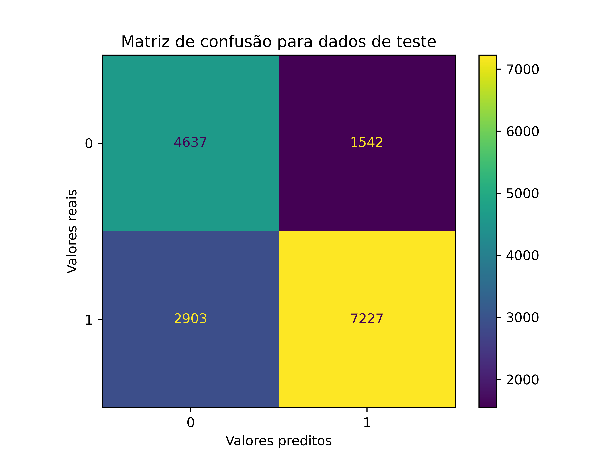

# Parte 4 - O modelo

## Seleção de *features* e *target*
Para chegarmos no modelo, precisamos selecionar as features de interesse, separarmos os dados em treino e teste e fazer as devidas transformações (em Z-score ou Min-Max Scaler).

Executamos a seleção dos *features* e do *target*. Segue abaixo a relação

> *Features*
> `Daily Time Spent on Site`;
> `Age`;
> `Daily Internet Usage`;
> `Topic len`;
> `Continent`;
> `Area Income`;
> `Male`;
>
> *Target*
> `Clicked on Ad`;

Executamos a separação entre treino e teste, sendo 80% treino e 20% teste. Garantimos que essa divisão preserve a proporção original do *target*.

## Construção de um *Pipeline* de pré-processamento
Desse ponto em diante, construímos uma *Pipeline* de tratamento de dados. Trata-se de uma "linha de pré-processamento" dos dados a serem usados no modelo. Apesar do nosso pré processamento ser bastante simples aqui, o ideal é amarrar todas as etapas de tratamento dentro de um *Pipeline* próprio do Scikit-Learn, de forma a evitar redundância no código. 

No nosso caso, tratamos as colunas numéricas num *Pipeline* a parte que conterá um imputador para dados faltantes (*SimpleImputer*) e um escalonamento (*MinMaxScaler*). As colunas categóricas passam pelo imputador e em seguida pela binarização (*OneHotEncoder*). Mesmo não tendo valores NaNs, pensamos na escalabilidade do *Pipeline*. E se algum dia ele encontrar valores NaNs?

Esses *Pipelines* então serão passados dentro de um *ColumnTransformer*, classe de objetos que gerencia quais colunas serão afetadas em quais processos. Finalmente, nas seções da Parte 2 o resultado será colocado em outro *Pipeline* junto com o modelo específico da seção.

A partir daqui nossos dados já estão no melhor formato para nossas análises.

## Aplicação do modelo
Partindo a pergunta de negócio, gostaríamos de otimizar a taxa de acerto dos anúncios, gerando um algoritmo que apresente uma boa *Precision*. Objetivamos reduzir disparos que não geram cliques.

Ao executar testes com alguns modelos e manipular seus hiperparâmetros, chegamos à conclusão de que **Árvore de Decisão** é o que apresenta a melhor *Precision*, mesmo apresentando outras métricas não tão boas.

Árvore de decisão é um algoritmo de machine learning muito utilizado, devido a sua versatilidade e estrutura de fácil visualização. Segue a premissa de decisões, partindo de um nó raiz, chegando até um nó folha, por meio dos ramos, que são as diferentes respostas.

Esta abordagem baseada em árvore permite representar e interpretar decisões complexas de uma forma compreensível, assemelhando-se a um fluxograma. Além disso, elas funcionam com diferentes tipos de dados e podem ser utilizadas tanto para problemas de classificação quanto de regressão. 

Para aplicar o modelo, executamos uma validação cruzada com dobras (*folds*) representativos da proporção do nosso *target*. Juntamos nosso *Pipeline* com o modelo da Árvore de Decisão e rodamos o treinamento. Todas as suas métricas ficaram acima dos 77%, especialmente a *Precision*. Seu resultado final foi a seguinte árvore:

## Otimização
Podemos agora começar a lidar com a otimização dos hiperparâmetros. Modificamos o critério e a métrica de divisão, a profundidade máxima e os números mínimos de entradas por folha e por separação. Usando *RandomizedSearchCV* para selecionar aleatoriamente valores entre os especificados. Os hiperparâmetros selecionados e a melhor métrica de *Precision* foi:

> *splitter* do tipo *random*
> *min_samples_split* de 7
> *min_samples_leaf* de 9
> *max_depth* de 4
> *criterion* do tipo *entropy*
>
> *Precision* de 82%

Com o melhor modelo em mãos, passamos os dados de treino por ele novamente para ver como ele se sai. Abaixo sua matriz de confusão.

Suas métricas foram:

> *F1* de 75.81%
> *Accuracy* de 72.03%
> *Precision* de 81.89% 
> *Recall* de 70.57%
> *ROC_AUC* de 72.49%

E então passamos o modelo pelos dados de teste. Abaixo sua matriz de confusão.

Suas métricas foram:

> *F1* de 76.48%
> *Accuracy* de 72.74%
> *Precision* de 82.41% 
> *Recall* de 71.34%
> *ROC_AUC* de 73.19%

Nosso modelo manteve um valor muito próximo do *Precision* de treino, apesar de levemente diferente. Suspeitas de *overfitting* ou *underfitting* não aparecem aqui, já que tanto para teste quanto para treino não tivemos métricas muito grandes (que indicaria *overfitting*) e nem muito pequenas (indicando *underfitting*). O *Recall* geral do modelo é sua pior métrica: 71,34%. 