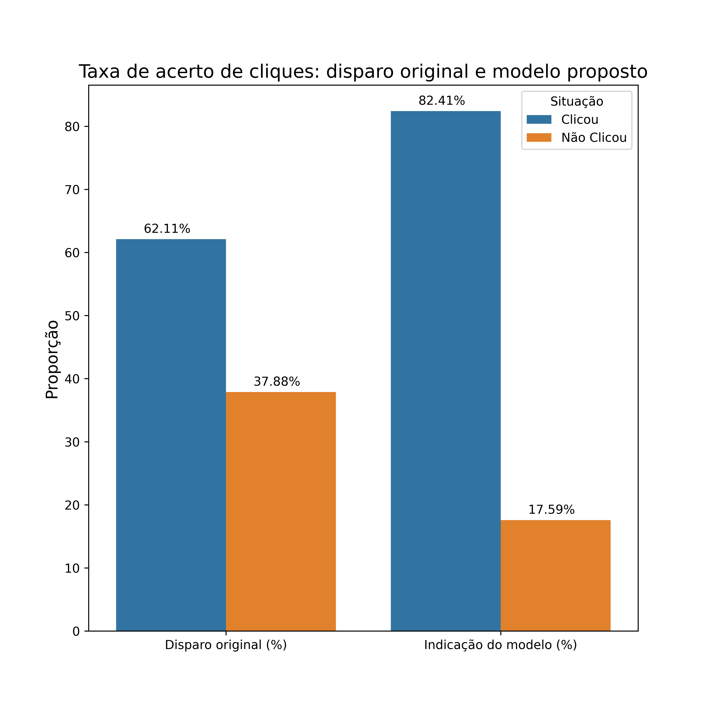

# Comparando o modelo final com a performance original da empresa

Como dito anteriormente, a base usada advém de uma tentativa anterior de disparo de anúncios que não usava uma estratégia em dados. Logo, todos os casos foram considerados como possíveis cliques mas apenas 62% deles clicaram. Com as sugestões do nosso modelo usando uma Árvore de Decisão, cerca de 86% dos usuários que indicamos o anúncio clicaram nele, um aumento percentual da taxa de acerto de 38%.

# Conclusões

Como vimos, um disparo massivo de anúncios é um investimento alto numa estratégia de CRM que precisa ser amparado por conhecimendos do perfil do público que visamos alcançar. Não levar isso em conta na hora de disparar conteúdo resulta exatamente no que vemos aqui: uma taxa muito reduzida de cliques e muita despesa desnecessária.

Nosso modelo proposto, uma Árvore de Decisão, é relativamente simples e leve, sendo cpaz de alcançar facilmente uma taxa de acerto superior àquela da base original. Ele também pode ser escalável e re-treinado caso suas métricas deixem deixe de ser aquilo que esperávamos.